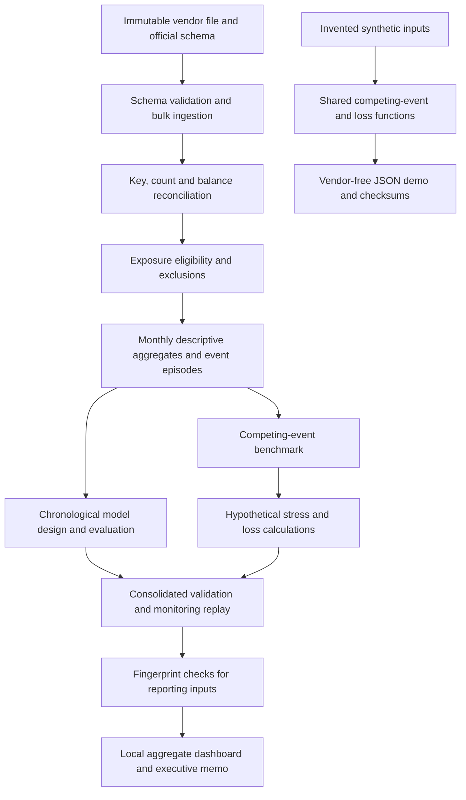

# Architecture and evidence flow

Python orchestrates and implements transparent calculations; DuckDB/SQL performs set-based aggregation; Parquet retains detailed analytical outputs. Raw data and accepted runs are immutable inputs. A new run gets a new directory. The dashboard presents bounded saved aggregates and does not fit models or load loan-level records.

The empirical model and illustrative loss engine are separate branches: the project does not claim the estimated 12-month model drives calibrated lifetime portfolio losses. Validation checks and reporting integrity must pass before a new dashboard is accepted.

The synthetic review path is self-contained. The historical path currently retains cohort-specific source and run references; generic orchestration, production scheduling and disaster recovery are not implemented.
